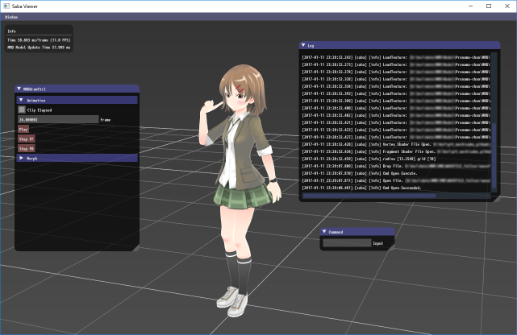
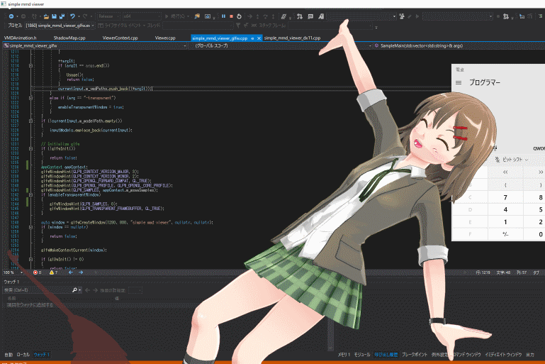
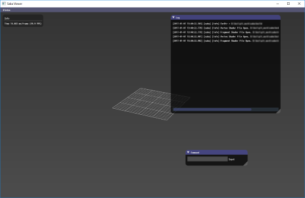

# Saba

[](https://travis-ci.org/benikabocha/saba)
[](https://ci.appveyor.com/project/benikabocha/saba)
[](https://github.com/benikabocha/saba/actions/workflows/build-linux.yml)

* MMD (PMD/PMX/VMD/VPD) を再生できるライブラリ
* Viewer (MMD/OBJ)
    * saba_viewer
* Example
    * simple_mmd_viewer_glfw (OpenGL 4.1)
    * simple_mmd_viewer_dx11 (DirectX 11)
    * simple_mmd_viewer_vulkan (Vulkan 1.0.65)
    * 透明ウィンドウ (GLFW 3.3.2 以上、Windows)




© 2017 Pronama LLC

## 重要な変更
[commit 7ba7020](https://github.com/benikabocha/saba/commit/7ba70208741d6cd5f0105f27a2264b555a5ce043)

このコミットから内部の uv が反転しました。

## 対応環境

* Window
  * Visual Studio 2019
  * Visual Studio 2017
  * Visual Studio 2015 Update 3
* Linux
* Mac

## 対応ファイル

* OBJ
* PMD
* PMX
* VMD
* VPD
* x ファイル (MMD拡張)

## ビルド方法

ビルドには CMake を使用します。
事前にインストールしてください。

### 必要なライブラリ

external ディレクトリに必要なライブラリはまとまっていますが、以下のライブラリは事前に用意してください。

* OpenGL
* [Bullet Physics](http://bulletphysics.org/wordpress/)
* [GLFW](http://www.glfw.org/)

#### mingw

`msys/cmake` は使用しないでください。
`mingw64/mingw-w64-x86_64-cmake` を使用するようにしてください。

https://gitlab.kitware.com/cmake/cmake/-/issues/21649

mingw64 の環境は以下のように用意してください。

```
pacman -S base-devel mingw-w64-x86_64-toolchain
pacman -S mingw-w64-x86_64-cmake
pacman -S mingw-w64-x86_64-ninja
pacman -S mingw-w64-x86_64-mesa
```

### 1. Bullet Physics の準備

#### Bullet Physics の準備 (Windows)

Bullet Physics をビルドする際、以下の設定を参考にしてください。

```
cmake -G "Visual Studio 14 2015 Win64" ^
    -D CMAKE_INSTALL_PREFIX=<bullet のインストールディレクトリ> ^
    -D INSTALL_LIBS=ON ^
    -D USE_MSVC_RUNTIME_LIBRARY_DLL=On ^
    -D BUILD_CPU_DEMOS=Off ^
    -D BUILD_OPENGL3_DEMOS=Off ^
    -D BUILD_BULLET2_DEMOS=Off ^
    -D BUILD_UNIT_TESTS=Off ^
    ..

cmake --build . --config Debug --target ALL_BUILD
cmake --build . --config Debug --target INSTALL
cmake --build . --config Release --target ALL_BUILD
cmake --build . --config Release --target INSTALL
```

`-G "Visual Studio 14 2015 Win64"` の部分は、環境により適宜変更してください。

#### Bullet Physics の準備 (Mac)

```
brew install bullet
```

#### Bullet Physics の準備 (Linux)

Ubuntu:

```
apt-get install libbullet-dev
```

Arch linux:

```
pacman -S bullet
```

#### Bullet Physics の準備 (mingw)

```
pacman -S mingw-w64-x86_64-bullet
```

### 2. GLFW の準備

#### GLFW の準備 (Windows)

以下からダウンロードしてください。

[Download](http://www.glfw.org/download.html)

#### GLFW の準備 (Mac)

```
brew install glfw
```

#### GLFW の準備 (Linux)

Ubuntu:

```
apt-get install libglfw3-dev
```

Arch linux:

```
pacman -S glfw
```

#### GLFW の準備 (mingw)

```
pacman -S mingw-w64-x86_64-glfw
```

### 3. ソースコードのクローン

```
git clone https://github.com/benikabocha/saba.git
cd saba
```

### 4. CMake の実行とビルド

#### CMake の実行とビルド (Windows)

```
mkdir build
cd build
cmake -G "Visual Studio 14 2015 Win64" ^
    -D SABA_BULLET_ROOT=<bullet のインストールディレクトリ> ^
    -D SABA_GLFW_ROOT=<GLFW のインストールディレクトリ> ^
    ..
```

作成された *.sln ファイルを開き、ビルドしてください。

"saba_viewer" プロジェクトがアプリケーションとなります。

#### CMake の実行とビルド (Mac/Linux)

```
mkdir build
cd build
cmake ..
make -j4
./saba_viewer
```

動作が重い場合は、以下をお試しください。

```
cmake -DCMAKE_BUILD_TYPE=RELEASE ..
make -j4
```

#### CMake の実行とビルド (mingw)

```
mkdir build
cd build
cmake ..
ninja
./saba_viewer
```

#### GLFW をビルドする場合 (Option)

GLFW をビルドする場合はサブモジュールの更新を行ってください。

```
git clone https://github.com/benikabocha/saba.git
cd saba
git submodule init
git submodule update
mkdir build
cd build
cmake -D SABA_FORCE_GLFW_BUILD ..
```

## 初期化設定

起動時のカレントディレクトリに"init.json"または、"init.lua"ファイルを配置することにより初期化時の設定を行うことができます。

"init.json" 、 "initlua" は、 UTF-8 で記述してください。

### init.json を使用する
```javascript
{
    "MSAAEnable":	true,
    "MSAACount":	8,
    "Commands":[
        {
            "Cmd":"open",
            "Args":["test.pmx"]
        },
        {
            "Cmd":"open",
            "Args":["test.vmd"]
        }
    ]
}
```
#### MSAAEnable

MSAA を有効にします。

#### MSAACount

MSAA のサンプリング数を設定します。
MSAAEnable が true の場合のみ有効です。

#### Commands

起動時に実行するコマンドを設定します。

### init.lua を使用する
```lua
MSAA = {
    Enable  = true,
    Count    = 8
}

InitCamera = {
    Center = {x = 0, y = 10, z = 0},
    Eye = {x = 0, y = 10, z = 50},
    NearClip = 1.0,
    FarClip = 2000.0,
    Radius = 100
}

InitScene = {
    UnitScale = 10
}

Commands = {
    {
        Cmd     = "open",
        Args    = {"test.pmx"},
    },
    {
        Cmd     = "open",
        Args    = {"test.vmd"},
    },
    {
        Cmd     = "play"
    },
}
```

#### MSAA.Enable

MSAA を有効にします。

#### MSAA.Count

MSAA のサンプリング数を設定します。
MSAAEnable が true の場合のみ有効です。

#### InitCamera.Center

シーン初期化時のカメラ中心位置を設定します。

#### InitCamera.Eye

シーン初期化時のカメラ視点位置を設定します。

#### InitCamera.NearClip

シーン初期化時のニアクリップを設定します。

#### InitCamera.FarClip

シーン初期化時のファークリップを設定します。

#### InitCamera.Radius

シーン初期化時のズーム可能半径を設定します。

#### InitScene.UnitScale

シーン初期化時のグリッドサイズを設定します。

#### Commands

起動時に実行するコマンドを設定します。

#### スクリプトを実行する

"init.lua" ではスクリプトを実行することもできます。
プログラムに渡されるコマンドライン引数は`Args`で取得できます。

```lua
ModelIndex = 1
print(Args[1])

Commands = {
    {
        Cmd     = "open",
        Args    = {Models[ModelIndex]},
    },
    {
        Cmd     = "open",
        Args    = {"test.vmd"},
    },
    {
        Cmd     = "play"
    },
}
```


## 操作方法

起動すると、以下の画面が表示されます。



見たいモデルをドラッグアンドドロップしてください。
MMD の場合は、モデル (PMD、PMX) を読み込んだ後、アニメーション (VMD) を読み込ませると、アニメーションできます。

### カメラ

マウスをドラッグすることにより、カメラを操作できます。
トラックパッド等を使用時は、キーボードのキーを組み合わせて動作させることもできます。

* 左ボタン (z + 左ボタン): 回転
* 右ボタン (c + 左ボタン): 遠近
* 中ボタン (x + 左ボタン): 移動

### コマンド

saba_viewer で使用できるコマンドです。

#### open

`open <file path>`

ファイルを開きます。
動作はドラックアンドドロップと変わりません。

対応ファイル:

* PMD
* PMX
* VMD  (事前に PMD または PMX を開いてください)
* OBJ

モデルファイルの場合、開いたモデルは選択状態となります。
モデル名は `model_001` のように、 `model_` 後に読み込み順のIDが降られます。

#### select

`select <model name>`

モデルを選択します。

#### clear

`clear [-all]`

モデルをクリアします。

引数無しで呼び出した際、選択中のモデルをクリアします。

`-all` を指定した際、すべてのモデルをクリアします。

#### play

`play`

アニメーションを再生します。

#### stop

`stop`

アニメーションを停止します。

#### translate

`translate x y z`

選択中のモデルを移動します。

#### rotate

`rotate x y z`

選択中のモデルを回転します。

#### scale

`scale x y z`

選択中のモデルをスケールします。

#### refreshCustomCommand

`refreshCustomCommand`

カスタムコマンドをリフレッシュします。
再起動せずにカスタムコマンドを更新できます。

#### enableUI

`enableUI [false]`

UIの表示、非表示を設定します。
<F1> キーで表示を切り替えることもできます。

#### clearAnimation

`clearAnimation [-all]`

選択モデルのアニメーションをクリアします。
-all を指定すると、全モデルのアニメーションをクリアします。

#### clearSceneAnimation

`clearSceneAnimation`

カメラアニメーション等のシーンにかかわるアニメーションをクリアします。

## カスタムコマンド

Lua でカスタムコマンドを作成することができます。
カレントディレクトリに "command.lua" を配置し、起動すると Lua で作成したカスタムコマンドが使用できます。

例えば、以下のようなモデル、アニメーションのロードのスクリプトを作成し、ロードの操作をマクロとして登録することができます。

"command.lua" は、 UTF-8 で記述してください。

```lua
function OpenModel(files)
    return function ()
        ExecuteCommand("clear", "-all")
        for i, filename in ipairs(files) do
            ExecuteCommand("open", filename)
        end
    end
end

function OpenAnim(files, isPlay)
    return function ()
        ExecuteCommand("clearAnimation", "-all")
        ExecuteCommand("clearSceneAnimation")
        for i, filename in ipairs(files) do
            ExecuteCommand("open", filename)
        end
        if isPlay then
            ExecuteCommand("play")
        end
    end
end

-- Register Model Load Command
RegisterCommand("", OpenModel({"Model1_Path"}), "01_Model/Menu1")
RegisterCommand("", OpenModel({"Model2_Path"}), "01_Model/Menu2")

-- Register Animation Load Command
anims = {
    "ModelAnim_Path",
    "CameraAnim_Path",
}
RegisterCommand("", OpenAnim(anims, true), "02_Anim/Anim1")

```

"command.lua" で使用できるコマンドは以下になります。

### RegisterCommand
```lua
RegisterCommand(commandName, commandFunc, menuName)
-- コマンドを登録します。

-- commandName : コマンド名
-- 空文字列の場合、コマンド名は自動的に作成されます。

-- commandFunc : コマンド関数

-- menuName : メニュー名
-- カスタムコマンドをメニューに追加する際の名前です。
-- 空の場合はメニューに追加されません
-- `/` で階層を追加することができます。
```
### ExecuteCommand
```lua
ExecuteCommand(command, args)
-- コマンドを実行します。

-- command : 実行するコマンド

--- args : コマンドに渡す引数
--- 文字列または、テーブルです。
```

## ライブラリの使い方

[Wiki](https://github.com/benikabocha/saba/wiki/How-to-use-library)

[Qiita](http://qiita.com/benikabocha/items/ae9d48e314f51746f453)

### 使用例

* sanko-shoko.net (AR Example) http://www.sanko-shoko.net/note.php?id=sbtj
